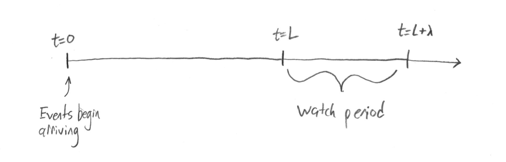
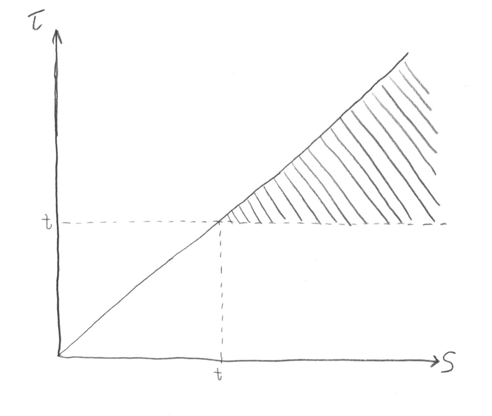

```{r, include = FALSE}
knitr::opts_chunk$set(
  collapse = TRUE,
  comment = "#>"
)
```

```{r setup}
library(gammacount)

library(ggplot2)
library(gridExtra)
library(foreach)
library(dplyr)
```

# Gamma-Count (GC) Distribution

In a single sentence, the gamma-count distribution models the count of event arrivals in an interval when the times between events are distributed according to a gamma distribution. 

This distribution was first derived in @winkelmann1995duration. @zeviani2013gammacount also provides a good overview of the distribution and its potential uses. It is a generalization of a Poisson distribution, since the exponentially distributed arrival times of a Poisson process are special cases of the gamma distributed arrival times in this process. In this vignette I use the phrase "gamma-count process" to relate to the gamma-count distribution in the same way a Poisson process is related to the Poisson distribution.

## Distribution Summary \label{sec:gc-definition}

Let $\delta_i \sim \mathrm{gamma}(\alpha,\alpha)$, $i \geq 1$ be independent and identically distributed gamma wait times between events, so that $\tau_n = \sum_{i=1}^n \delta_i$ is the arrival time of the $n^\text{th}$ event. Note that $\mathrm{E}[\delta_i] = 1$ for all values of $\alpha$, but $\alpha$ affects the variance of $\delta_i$. I say $X \sim \mathrm{gc}(\lambda, \alpha)$ if $X$ is the count of these events in the interval $(0, \lambda]$.

$$
X \leq n \iff \tau_{n+1} > \lambda \\
P(X \leq n) = P(\tau_{n+1} > \lambda) \\
\tau_{n+1} = \sum_{i=1}^{n+1} \delta_i \sim \mathrm{gamma}((n+1)\alpha, \alpha)
$$

Then the CDF of the gamma-count distribution can be expressed in terms of the CDF of the gamma distribution, which is available in base `R` with `pgamma`. 

## Under and Over-dispersion; Clustering and Regularity

The effect of $\alpha$ on the gamma-count distribution is changing its dispersion. The value $\alpha=1$ results in the equidispersed Poisson distribution. (The variance of a Poisson distributed random variable always equals its mean.) Values of $\alpha > 1$ result in an underdispersed distribution (lower variance), and values of $\alpha < 1$ result in an overdispersed distribution (higher variance).

```{r dispersionplots, fig.width=7, fig.height=3, fig.align="center", fig.cap="Probability mass function of gamma-count distributions with varying dispersion"}
lambda <- 15
x <- seq(0, 30)

equi <- dgc(x, lambda, 1)
over <- dgc(x, lambda, 0.25)
under <- dgc(x, lambda, 4)

ymax <- max(c(equi, over, under))
par(mfrow=c(1,3))
barplot(equi,  names.arg=x, main="Equidispersion", ylim=c(0, ymax))
barplot(over,  names.arg=x, main="Overdispersion", ylim=c(0, ymax))
barplot(under, names.arg=x, main="Underdispersion", ylim=c(0, ymax))
```

The parameter $\alpha$ can also be thought of as affecting clustering and regularity in the underlying gamma-count process (i.e. the event arrivals themselves).  For $\alpha < 1$ there is a high probability that an event will immediately follow the previous one but then a long tail of large arrival times, resulting in clusters of events with larger gaps between the clusters. On the other hand for $\alpha > 1$, there is a lower probability of an arrival time being very far from the expected value of 1, resulting in more regularly spaced event arrivals. @winkelmann1995duration describes this in terms of hazard functions: for shape parameters greater than 1, gamma distributions have increasing hazard functions while for shape parameters less than 1, gamma distributions have decreasing hazard functions.

```{r arrivalplots, fig.width=7, fig.height=4, fig.align="center", fig.cap="Demonstration of clustering and regularity in arrivals"}
set.seed(20)

lambda <- 30

n <- 100
delta.equi  <- rgamma(n, shape=1, rate=1)
delta.over  <- rgamma(n, shape=0.25, rate=0.25)
delta.under <- rgamma(n, shape=4, rate=4)
tau.equi  <- cumsum(delta.equi)
tau.over  <- cumsum(delta.over)
tau.under <- cumsum(delta.under)

plot(x=tau.equi, y=rep(0.5, n), pch="x",  col="black",
     main="Event Arrival Times", xlab="Time (t)", ylab="", yaxt="n",
     ylim=c(0,2.5), xlim=c(0, lambda))
points(x=tau.over, y=rep(1,n), col="red", pch="x")
points(x=tau.under, y=rep(1.5,n), col="blue", pch="x")
legend("top", legend=c("Equidispersed", "Clustered","Regular"),
       pch="x", col=c("black", "red", "blue"), horiz=TRUE)
```

In the figure above, roughly the same number of events have arrived between 0 and $\lambda=`r lambda`$: `r sum(tau.equi <= lambda)` in the equidispersed case, `r sum(tau.over <= lambda)` in the overdispersed case, and `r sum(tau.under <= lambda)` in the underdispersed case. But $\alpha$ has affected the appearance and the spacing of the events. If this simulation were repeated, this would result in the overdispersed count having a high variance and the underdispersed count having a low variance as seen earlier.

## Early process behavior

There is a problem that occurs very early in this process when $\alpha$ is small (overdispersion) or large (underdispersion). Because the clock begins ticking for the first arrival $\delta_1$ at $t=0$, it is as if there were an uncounted event which arrived exactly at $t=0$. Because we also start counting events at $t=0$, the behavior that occurs here influences our count.  If $\alpha \gg 1$ then the first counted event will be unlikely to occur soon due to regularity, and for $\alpha \approx 0$ the process is very likely to start with an immediate cluster of early events before the next longer gap.

For a Poisson process (special case of $\alpha = 1$) this doesn't matter because the exponential distribution is memoryless and the behavior near $t=0$ is the same as the behavior elsewhere.  If $\lambda$ is large this also has less effect because the early times account for less of the total watch time. But if $\lambda$ is small, then this early behavior dominates the whole process.

This issue is illustrated by the mean and variance plots below for varying values of $\alpha$ and small $\lambda$.

```{r plotmeanvar1, fig.width=7, fig.height=7}
lambda.vals <- seq(0.02, 3, by=0.02)
alpha.vals <- c(1, 2, 10, 20, 0.5, 0.1)
max.x <- 200

# Create data frame of means and variances for each lambda and alpha
meanvar <- foreach(alpha=alpha.vals, .combine="rbind") %do% {
  foreach(lambda=lambda.vals, .combine="rbind") %do% {
    x <- c(0, seq_len(max.x))
    probs <- dgc(x, lambda, alpha)
    data.frame(lambda=lambda, alpha=alpha, under=(alpha >= 1), over=(alpha <= 1),
               mean=sum(probs * x),
               var=sum(probs * x^2) - sum(probs * x)^2)
  }
}
meanvar$alpha <- factor(meanvar$alpha, levels=alpha.vals)

meanplot.under <- ggplot(meanvar %>% filter(under == TRUE), aes(x=lambda, y=mean, color=alpha)) + 
  geom_line() + 
  ggtitle("Underdispersed Means")
varplot.under <- ggplot(meanvar %>% filter(under == TRUE), aes(x=lambda, y=var, color=alpha)) + 
  geom_line() + 
  ggtitle("Underdispersed Variances")
meanplot.over <- ggplot(meanvar %>% filter(over == TRUE), aes(x=lambda, y=mean, color=alpha)) + 
  geom_line() + 
  ggtitle("Overdispersed Means")
varplot.over <- ggplot(meanvar %>% filter(over == TRUE), aes(x=lambda, y=var, color=alpha)) + 
  geom_line() + 
  ggtitle("Overdispersed Variances")
grid.arrange(meanplot.under, varplot.under, meanplot.over, varplot.over, ncol=2, nrow=2)
```

In particular, notice that the mean for $\alpha < 1$ increases very quickly at first. This behavior would make it difficult to model counts with low mean and high dispersion using this distribution. For $\alpha > 1$, notice that the mean lags behind $\lambda$ and sometimes has somewhat step function-like behavior, while the variance does not increase monotonically with $\lambda$. This makes modeling low mean underdispersed counts difficult as well, since small changes in the parameters may result in large and unintuitive changes to the distribution.

## Moving to a random start time

I attempt to fix this by adjusting the starting time of the process away from $t=0$. That is, instead of counting events during the interval $(0,\lambda]$ we count events during the interval $(L,L+\lambda]$ for some start time $L$. 

{width=7in}

The intuition is that if $L$ is large enough, then no matter how regular or clustered arrivals are in the process their locations near $L$ are uncertain. If $\alpha=1$ (the process is a Poisson process) then the time $L$ doesn't affect the distribution of counts, again, since the exponential distribution is memoryless. Instead of fixing $L$ at a large vaue, imagine we are somehow able to randomly choose $L$ uniformly on the whole of the positive number line. Alternatively, imagine $L \sim unif(0, m)$ and let $m \to \infty$. 

# First Arrival Time Distribution

With the new start time $L$, consider the time between $L$ and the first event arrival after $L$. This section derives a distribution for this time, which will be useful later. In the notation of the gamma-count process, we will define this first time as $\delta_1 = \tau_1$, and renumber subsequent arrivals starting at this point. In this section, the first arrival time is refered to simply as $\tau$.

## Derivation of the distribution

First, call $S$ the time between the event immediately before $L$ and the event immediately after $L$. In other words, $S$ is the gap between events in which $L$ happens to land. Since $S$ is a gap between events we might think that $S \sim \mathrm{gamma}(\alpha, \alpha)$, and if $S$ were a gap chosen uniformly from all gaps this would be true. However, we are not choosing a gap at random, we are choosing a point $L$ randomly and looking at the size of the gap in which it lands. Therefore longer gaps are more likely to be chosen proportional to their length. So an extra $s$ is multiplied by the $\mathrm{gamma}(\alpha, \alpha)$ density and therefore $S \sim \mathrm{gamma}(\alpha + 1, \alpha)$.

Now we know that $L$ is within a gap between events $S \sim \mathrm{gamma}(\alpha + 1, \alpha)$. We can assume that $L$ is uniformly distributed between the events immediately before and immediately after it, so that leaves $\tau$ having the following hierarchically defined distribution:
\begin{align*}
\tau | S=s &\sim \mathrm{uniform}(0, s) \\
S &\sim \mathrm{gamma}(\alpha + 1, \alpha)
\end{align*}

We say $\tau \sim \mathrm{ft}(\alpha)$.

## First arrival time density

The joint density $f(t, s)$ of $(\tau, S)$ is then
$$f(t,s) = \frac{1}{s} \cdot \frac{\alpha^{\alpha+1}}{\Gamma(\alpha+1)} s^{\alpha} e^{-\alpha s}, \quad 0 \leq t \leq s.$$

We can find the marginal density $f(t)$ of $\tau$ by integrating out $s$:
\begin{align*}
f(t) &= \int_0^\infty f(t,s) \mathrm{d}s = \int_t^\infty f(t,s) \mathrm{d}s \\
&= \int_t^\infty \frac{1}{s} \cdot \frac{\alpha^{\alpha+1}}{\Gamma(\alpha+1)} s^{\alpha} e^{-\alpha s} \mathrm{d}s \\
&= \int_t^\infty \cdot \frac{\alpha^{\alpha+1}}{\Gamma(\alpha+1)} s^{\alpha-1} e^{-\alpha s} \mathrm{d}s \\
&= \int_t^\infty \cdot \frac{\alpha^{\alpha}}{\Gamma(\alpha)} s^{\alpha-1} e^{-\alpha s} \mathrm{d}s.
\end{align*}
So the density of $\tau$ can be expressed in terms of the CDF of a $\mathrm{gamma}(\alpha, \alpha)$ distribution, which is available in base `R` with `pgamma`.

## First arrival time CDF

To find the CDF of $\tau$, we start with the same joint density $f(t, s)$ of $(\tau, S)$ and integrate to find $P(\tau > t) = 1 - F(t)$. 

{width=4in}

\begin{align*}
P(\tau > t) &= \int_t^\infty \int_t^s \frac{1}{s} \frac{\alpha^{\alpha+1}}{\Gamma(\alpha+1)} s^\alpha e^{-\alpha s} \mathrm{d}\tau \mathrm{d}s \\
&= \int_t^\infty \frac{s-t}{s} \frac{\alpha^{\alpha+1}}{\Gamma(\alpha+1)} s^\alpha e^{-\alpha s} \mathrm{d}s \\
&= \int_t^\infty \frac{\alpha^{\alpha+1}}{\Gamma(\alpha+1)} s^\alpha e^{-\alpha s} \mathrm{d}s - t \int_t^\infty \frac{\alpha^{\alpha+1}}{\Gamma(\alpha+1)} s^{\alpha-1} e^{-\alpha s} \mathrm{d}s \\
&= \int_t^\infty \frac{\alpha^{\alpha+1}}{\Gamma(\alpha+1)} s^\alpha e^{-\alpha s} \mathrm{d}s - t \int_t^\infty \frac{\alpha^{\alpha}}{\Gamma(\alpha)} s^{\alpha-1} e^{-\alpha s} \mathrm{d}s \\
&= \mathrm{pgamma}(t, \alpha+1, \alpha, \mathrm{lower.tail=F}) - t \cdot \mathrm{pgamma}(t, \alpha, \alpha, \mathrm{lower.tail=F})
\end{align*}

## First arrival time properties

### Expected value

The expected value of the first arrival time can be found with the law of iterated expectation:
\begin{align*}
\mathrm{E}[\tau] &= \mathrm{E}[\mathrm{E}[\tau | S]] \\
&= \mathrm{E}[S/2] \\
&= \frac{\alpha+1}{2\alpha}
\end{align*}

### Variance

The variance of the first arrival time can be found with the law of total variance:
\begin{align*}
\mathrm{Var}(\tau) &= \mathrm{E}[\mathrm{Var}(\tau | S)] + \mathrm{Var}(\mathrm{E}[\tau | S]) \\
&= \mathrm{E}\left[\frac{1}{12}S^2\right] + \mathrm{Var}\left(\frac{1}{2}S\right) \\
&= \frac{1}{12}\mathrm{Var}(S) + \frac{1}{12}\mathrm{E}[S]^2 + \frac{1}{4}\mathrm{Var}(S) \\
&= \frac{1}{3}\mathrm{Var}(S) + \frac{1}{12}\mathrm{E}[S]^2 \\
&= \frac{\alpha + 1}{3\alpha^2} + \frac{(\alpha+1)^2}{12\alpha^2} \\
&= \frac{\alpha^2+6\alpha+5}{12\alpha^2} \\
&= \frac{\alpha+1}{2\alpha}\cdot\frac{\alpha+5}{6\alpha} \\
&= \mathrm{E}[\tau]\frac{\alpha+5}{6\alpha}
\end{align*}

### Mode

Since the PDF of $\tau$ is strictly decreasing, its mode is at the leftmost endpoint $\tau = 0$.

## Simulations of first arrival times

In this section, I provide simulations verifying the derived first arrival time distributions.

```{r first-arrival-simulations, fig.width=7, fig.height=5} 
set.seed(2020)

n <- 5000
numevents <- 400
Lmin <- 100
Lmax <- 200

alphas <- c(0.25, 1, 4)

par(mfcol=c(2,3))
for (alpha in alphas) {
  S <- rep(0, n)
  tau <- rep(0, n)
  for (i in 1:n) {
    arrivals <- cumsum(rgamma(numevents, alpha, alpha))
    L <- runif(1, min=Lmin, max=Lmax)
    priorevent <- max(arrivals[arrivals <= L])
    nextevent <- min(arrivals[arrivals > L])
    S[i] <- nextevent - priorevent
    tau[i] <- nextevent - L
  }
  
  hist(S, freq=FALSE, main=paste("Gap containing L, alpha =", alpha))
  x <- seq(0, max(S), by=0.01)
  lines(x, dgamma(x, alpha+1, alpha), col="red")
  
  hist(tau, freq=FALSE, main=paste("First Arrival Time, alpha =", alpha))
  x <- seq(0, max(tau), by=0.01)
  lines(x, dft(x, alpha), col="blue")
}
```

The above code simulates `r numevents` event arrival times, picks an $L$ between `r Lmin` and `r Lmax`, then measures the size of the gap in which $L$ lands and the time between $L$ and the next event. This process is repeated for `r length(alphas)` values of $\alpha$ and `r n` trials. The histograms are the empirical times and the blue or red lines are the theoretical distributions.

# Later Arrival Time Distributions

Now that we have the distribution for $\delta_1 = \tau_1 \sim \mathrm{ft}(\alpha)$ defined above, the natural next question is if we can similary know the distribution of later arrival times, $\tau_n = \sum_{i=1}^n \delta_i$ for $n > 1$. Recall that $\delta_i \sim \mathrm{gamma}(\alpha, \alpha)$ for $i > 1$.

We will say that $\tau_n \sim \mathrm{arrival}(n, \alpha)$, so that $\mathrm{ft}(\alpha) = \mathrm{arrival}(1, \alpha)$.

## Arrival time densities

We want the density of $\tau_n = \tau_1 + \sum_{i=2}^n \delta_i$ for $n > 1$. For this derivation, define $\Delta = \sum_{i=2}^n \delta_i$, and note that $\Delta \sim \mathrm{gamma}((n-1)\alpha, \alpha)$. We can do the convolution of the densities $f_{\tau_1}$ of $\tau_1$, and $f_\Delta$ of $\Delta$ to find the density of their sum.

$$
f_{\tau_n}(x) = \int_0^{x} f_{\tau_1}(x - t)f_\Delta(t) \mathrm{d}t
$$
If $Y$ is a random variable such that $Y \sim \mathrm{gamma}(\alpha, \alpha)$, then we can rewrite the integral above as
\begin{align*}
f_{\tau_n}(x) &= \int_0^{x} \mathrm{P}(Y > x - t)f_\Delta(t) \mathrm{d}t \\
&= \int_0^\infty \mathrm{P}(Y > x - t)f_\Delta(t) \mathrm{d}t - \int_x^\infty f_\Delta(t) \mathrm{d}t \\
&= \mathrm{P}(Y+\Delta > x) - \mathrm{P}(\Delta > x),
\end{align*}
because $\mathrm{P}(Y > x - t) = 1$ for $t > x$, and noticing that the first integral in the next step is a convolution of two gamma random variables. Since $Y + \Delta \sim \mathrm{gamma}(n\alpha, \alpha)$ we have this density also in terms of gamma CDFs.

$$
f_{\tau_n}(t) = Q(n\alpha, \alpha t) - Q((n-1)\alpha, \alpha t),
$$
where $Q(s,x) = \Gamma(s)^{-1}\int_x^\infty t^{s-1} e^{-t} \mathrm{d}t$ is the regularized upper incomplete gamma function.

## Arrival time CDFs

To find the CDF of $\tau_n$, we can use the identity $\int \Gamma(s, x) \mathrm{d}x = x\Gamma(s, x) - \Gamma(s+1, x) + C$ for $\Gamma(s, x) = \int_x^\infty t^{s-1} e^{-t} \mathrm{d}t$ the upper incomplete gamma function.
\begin{align*}
\int f_{\tau_n}(t) \mathrm{d}t &= \int \Gamma(n\alpha, \alpha t)/\Gamma(n\alpha) \mathrm{d}t - \int \Gamma((n-1)\alpha, \alpha t)/\Gamma((n-1)\alpha) \mathrm{d}t \\
&= \frac{1}{\alpha\Gamma(n\alpha)}(\alpha t \Gamma(n\alpha, \alpha t) - \Gamma(n\alpha + 1, \alpha t)) - \frac{1}{\alpha\Gamma((n-1)\alpha)}(\alpha t \Gamma((n-1)\alpha, \alpha t) - \Gamma((n-1)\alpha + 1, \alpha t)) + C\\
&= (t Q(n\alpha, \alpha t) - n Q(n\alpha + 1, \alpha t)) - (t Q((n-1)\alpha, \alpha t) - (n-1)Q((n-1)\alpha + 1, \alpha t)) + C
\end{align*}

At $t=0$, this antiderivative evaluates to $-1$, which gives us the constant of integration.

## Arrival time properties

### Expected value

From its construction as the sum of wait times, we have
\begin{align*}
\mathrm{E}[\tau_n] &= \mathrm{E}\left[\sum_{i=1}^n \delta_i \right] \\
&= \frac{\alpha + 1}{2\alpha} + n - 1 \\
&= n + \frac{1 - \alpha}{2\alpha}
\end{align*}

### Variance

Similarly by its construction, we have
\begin{align*}
\mathrm{Var}(\tau_n) &= \mathrm{Var}\left(\sum_{i=1}^n \delta_i \right) \\
&= \frac{\alpha+1}{2\alpha}\cdot\frac{\alpha+5}{6\alpha} + \frac{n - 1}{\alpha}
\end{align*}

### Mode

The mode of the distribution of $\tau_n$ is the maximal point of its density. We find this by setting its derivative equal to zero and solving:
\begin{align*}
\frac{\mathrm{d}}{\mathrm{d}t}f_{\tau_n}(t) &= \frac{\mathrm{d}}{\mathrm{d}t}\left(Q(n\alpha, \alpha t) - Q((n-1)\alpha, \alpha t)\right) \\
&= -\alpha\Gamma(n\alpha)^{-1}(\alpha t)^{n\alpha - 1}e^{-\alpha t} + \alpha\Gamma((n-1)\alpha)^{-1}(\alpha t)^{(n-1)\alpha - 1}e^{-\alpha t} \\
&= 0 \\
\implies t &= \frac{1}{\alpha}\left(\frac{\Gamma(n\alpha)}{\Gamma((n-1)\alpha)}\right)^{\frac{1}{\alpha}}
\end{align*}


# Gamma-Count with Random Start Time (GCRST)

Now we define the distribution of a count variable $X \sim \mathrm{gcrst}(\lambda, \alpha)$ to be the count of events which arrive in the interval $(L, L+\lambda]$, where $L$ is chosen randomly from the whole positive real number line.

However with the first arrival time distribution $\mathrm{ft}(\alpha)$ as defined in the previous section, we can reframe the random start time $L$ instead as a change in the distribution of the first arrival $\delta_1 = \tau_1$. Instead of counting events in the interval $(L, L+\lambda]$, we can count the events in $(0, \lambda]$ as before as long as we say $\delta_1 \sim \mathrm{ft}(\alpha)$. The count arising from this process should have the same distribution as if we were counting events in $(L, L+\lambda]$.
\begin{align*}
\delta_1 &\sim \mathrm{ft}(\alpha) \\
\delta_i &\sim \mathrm{gamma}(\alpha, \alpha),\ i \geq 2 \\
\tau_n &= \sum_{i=1}^n \delta_i
\end{align*}

Like before, we have
$$
X \leq n \iff \tau_{n+1} > \lambda \\
P(X \leq n) = P(\tau_{n+1} > \lambda).
$$
But now, $\tau_{n+1}$ no longer follows a gamma distribution. To calculate the distribution of $X$ we need to take some additional steps.

## Conditioning on First Arrival Time

To deal with the problematic distribution of $\tau_1$, we can condition on it. If $X \sim \mathrm{gcrst}(\lambda, \alpha)$ and $\tau \sim \mathrm{ft}(\alpha)$ is the first event arrival time which leads to $X$, then we want to know the distribution of $X | \tau$.

If $\tau > \lambda$, then $P(X = 0 | \tau > \lambda) = 1$. If the first event does not arrive in the watched interval, then the count is necessarily zero.

If $\tau \leq \lambda$, then we know at least one event has arrived and we need to count how many events arrive in the remaining time. Fortunately, we can use the original gamma-count distribution for this. Since the remaining gaps, $\delta_2, \delta_3, \dots$, are all distributed $\mathrm{gamma}(\alpha,\alpha)$ and begin at time $\tau$, then $\tau$ is the start of a standard gamma-count process. We can then say that $X|\tau \leq \lambda \overset{d}{=} 1 + X'$, where $X' \sim \mathrm{gc}(\lambda-\tau, \alpha)$

We can then write:
$$
P(X=x|\tau) = \begin{cases}
1, & \tau > \lambda, x=0 \\
P(X'=x-1), & \tau \leq \lambda, x>0 \\
0, & \text{otherwise},
\end{cases}
$$
where $X' \sim \mathrm{gc}(\lambda-\tau, \alpha)$.

## Joint GCRST and first arrival distribution

We can get the joint density of $X$ and $\tau$, $f(x, t)$ by multiplying the conditional probability found above by the marginal first arrival time density of $\tau$, $f_\tau(t)$:
\begin{align*}
f(x, t) &= P(X=x|\tau=t) \cdot f_\tau(t) \\
&= \begin{cases}
f_\tau(t), & t > \lambda, x=0 \\
P(X'=x-1)f_\tau(t), & t \leq \lambda, x>0 \\
0, & \text{otherwise},
\end{cases}
\end{align*}

## Marginal GCRST distribution

Finally, we can integrate the previous joint density over $t$ to be left with the marginal distribution of $X \sim \mathrm{gcrst}(\lambda, \alpha)$.
\begin{align*}
P(X=x) &= \int_0^\infty f(x, t) \mathrm{d}t \\
&= \begin{cases}
P(\tau > \lambda), & x=0 \\
\int_0^\lambda P(X'(t) = x-1)f_\tau(t) \mathrm{d}t, & x > 0,
\end{cases}
\end{align*}
where $X'(\tau) \sim \mathrm{gc}(\lambda-\tau, \alpha)$.

We can also write the complementary cdf of the GCRST distribution as an integral:
\begin{align*}
P(X>x) &= \begin{cases}
P(\tau <= \lambda), & x=0 \\
\int_0^\lambda P(X'(t) > x-1)f_\tau(t) \mathrm{d}t, & x > 0,
\end{cases}
\end{align*}
with $X'(\tau)$ same as above.

### Evaluating the GCRST cdf

In this section I evaluate the GCRST complementary cdf, $P(X > n)$ for the case where $n > 0$. My goal, same as elsewhere in this document, is to be able to express it in terms of a set finite number of evaluations of the `pgamma` function in `R`.

In this section I use $\Gamma(s, x) = \int_x^\infty t^{s-1} e^{-t} \mathrm{d}t$ as the upper incomplete gamma function, and $\gamma(s, x) = \int_0^x t^{s-1} e^{-t} \mathrm{d}t = \Gamma(s) - \Gamma(s, x)$ as the lower incomplete gamma function. I also use $Q(s, x) = \Gamma(s,x)/\Gamma(s)$ as the upper regularized incomplete gamma function, with $P(s,x) = \gamma(s,x)/\Gamma(s)$ as the lower regularized incomplete gamma function.

First, let's rewrite the integral in terms of these functions. For $X\sim \mathrm{gcrst}(\lambda,\alpha)$, $n > 0$, and $X'(\tau) \sim \mathrm{gc}(\lambda-\tau, \alpha)$,
\begin{align*}
I := \mathrm{P}(X > n) &= \int_0^\lambda f_\tau(t) \mathrm{P}(X'(t) > n-1) \mathrm{d}t \\
&= \int_0^\lambda Q(\alpha, \alpha t)P(n\alpha, \alpha(\lambda - t)) \mathrm{d}t \\
&= (\Gamma(\alpha)\Gamma(n\alpha))^{-1} \int_0^\lambda \Gamma(\alpha, \alpha t)\gamma(n\alpha, \alpha(\lambda - t)) \mathrm{d}t \\
&= (\alpha\Gamma(\alpha)\Gamma(n\alpha))^{-1} \int_0^{\alpha\lambda} \Gamma(\alpha, x) \gamma(n\alpha, \alpha\lambda - x) \mathrm{d}x, & \text{through substituting $x=\alpha t$}
\end{align*}
Here, $Q(\alpha, \alpha t) = f_\tau(t)$, and the $P(n\alpha, \alpha(\lambda - t)) = \mathrm{P}(X'(t) > n-1)$. (Note the difference between $P(\cdot, \cdot)$, the lower regularized incomplete gamma function and $\mathrm{P}$, the probability operator. Sorry for the confusion, I will try to make it clear when I am using the probability operator.) The second equality comes from requiring the $n^{th}$ arrival to occur within the remaining time $\lambda - t$, in the gamma-count process.

Using integration by parts with $u=\gamma(n\alpha, \alpha\lambda - x)$ and $\mathrm{d}v = \Gamma(\alpha, x)\mathrm{d}x$ gives next:
\begin{align*}
I &= \left.(\alpha\Gamma(\alpha)\Gamma(n\alpha))^{-1} (x\Gamma(\alpha, x) - \Gamma(\alpha + 1, x))\gamma(n\alpha, \alpha\lambda - x)\right|_0^{\alpha\lambda} \\
&\quad+ (\alpha\Gamma(\alpha)\Gamma(n\alpha))^{-1}\int_0^{\alpha\lambda} (x\Gamma(\alpha, x) - \Gamma(\alpha + 1, x))(\alpha\lambda - x)^{n\alpha - 1}e^{-(\alpha\lambda - x)}\mathrm{d}x \\
&= \left.(\alpha\Gamma(\alpha)\Gamma(n\alpha))^{-1} (x\Gamma(\alpha, x) - \Gamma(\alpha + 1, x))\gamma(n\alpha, \alpha\lambda - x)\right|_0^{\alpha\lambda} & := A \\
&\quad+ (\alpha\Gamma(\alpha)\Gamma(n\alpha))^{-1}\int_0^{\alpha\lambda} x\Gamma(\alpha, x)(\alpha\lambda - x)^{n\alpha - 1}e^{-(\alpha\lambda - x)}\mathrm{d}x & := B\\
&\quad- (\alpha\Gamma(\alpha)\Gamma(n\alpha))^{-1}\int_0^{\alpha\lambda} \Gamma(\alpha + 1, x)(\alpha\lambda - x)^{n\alpha - 1}e^{-(\alpha\lambda - x)}\mathrm{d}x & := C
\end{align*}
We label the parts as shown in the right margin so that $I = A + B - C$, and proceed with each part.

First,
\begin{align*}
A &= \left.(\alpha\Gamma(\alpha)\Gamma(n\alpha))^{-1} (x\Gamma(\alpha, x) - \Gamma(\alpha + 1, x))\gamma(n\alpha, \alpha\lambda - x)\right|_0^{\alpha\lambda} \\
&= (\alpha\Gamma(\alpha)\Gamma(n\alpha))^{-1} \Gamma(\alpha+1, 0) \gamma(n\alpha, \alpha\lambda) \\
&= P(n\alpha, \alpha\lambda).
\end{align*}

Next, we find $C$:
\begin{align*}
C &= (\alpha\Gamma(\alpha)\Gamma(n\alpha))^{-1}\int_0^{\alpha\lambda} \Gamma(\alpha + 1, x)(\alpha\lambda - x)^{n\alpha - 1}e^{-(\alpha\lambda - x)}\mathrm{d}x \\
&= \int_0^{\alpha\lambda} Q(\alpha + 1, x) \left[\frac{1}{\Gamma(n\alpha)}(\alpha\lambda - x)^{n\alpha - 1}e^{-(\alpha\lambda - x)}\right] \mathrm{d}x \\
&= \int_0^{\alpha\lambda} Q(\alpha + 1, \alpha\lambda - t) \left[\frac{1}{\Gamma(n\alpha)} t^{n\alpha - 1}e^{-t}\right] \mathrm{d}t, & \text{by substituting $t=\alpha\lambda - x$.}
\end{align*}

This is starting to look a lot like the convolution between the complementary cdf of a $\mathrm{gamma}(\alpha + 1, 1)$ random variable and the pdf of a $\mathrm{gamma}(n\alpha, 1)$ random variable. Let's get it the rest of the way there. To make $Q$ behave more like the $\mathrm{gamma}$ complementary cdf, assume that $Q(s, x) = 1$ for $x < 0$. Note that this doesn't change the value of the integral so far because $\alpha\lambda - t \geq 0$ for $0 \leq t \leq \alpha\lambda$.
\begin{align*}
C &= \int_0^\infty Q(\alpha + 1, \alpha\lambda - t) \left[\frac{1}{\Gamma(n\alpha)} t^{n\alpha - 1}e^{-t}\right] \mathrm{d}t - \int_{\alpha\lambda}^\infty \frac{1}{\Gamma(n\alpha)} t^{n\alpha - 1}e^{-t} \mathrm{d}t \\
&= Q((n+1)\alpha + 1, \alpha\lambda) - Q(n\alpha, \alpha\lambda).
\end{align*}

Now we find $B$. Starting with the same substitution of $t=\alpha\lambda - x$, we get:
\begin{align*}
B &= (\alpha\Gamma(\alpha)\Gamma(n\alpha))^{-1}\int_0^{\alpha\lambda} x\Gamma(\alpha, x)(\alpha\lambda - x)^{n\alpha - 1}e^{-(\alpha\lambda - x)}\mathrm{d}x \\
&= \frac{1}{\alpha}\int_0^{\alpha\lambda} x \cdot Q(\alpha,x) \left[\frac{1}{\Gamma(n\alpha)} (\alpha\lambda - x)^{n\alpha - 1}e^{-(\alpha\lambda - x)}\right]\mathrm{d}x \\
&= \frac{1}{\alpha}\int_0^{\alpha\lambda} (\alpha\lambda - t) Q(\alpha, \alpha\lambda - t) \left[\frac{1}{\Gamma(n\alpha)} t^{n\alpha - 1}e^{-t}\right]\mathrm{d}t \\
&= \lambda \int_0^{\alpha\lambda} Q(\alpha, \alpha\lambda - t) \left[\frac{1}{\Gamma(n\alpha)} t^{n\alpha - 1}e^{-t}\right]\mathrm{d}t - \frac{1}{\alpha}\int_0^{\alpha\lambda} Q(\alpha, \alpha\lambda - t) \left[\frac{1}{\Gamma(n\alpha)} t^{n\alpha}e^{-t}\right]\mathrm{d}t \\
&:= B1 - B2
\end{align*}
Then we can notice the same convolution pattern as in $C$ to evaluate $B1$ and $B2$:
\begin{align*}
B1 &= \lambda \int_0^{\alpha\lambda} Q(\alpha, \alpha\lambda - t) \left[\frac{1}{\Gamma(n\alpha)} t^{n\alpha - 1}e^{-t}\right]\mathrm{d}t \\
&= \lambda \left[Q((n+1)\alpha, \alpha\lambda) - Q(n\alpha, \alpha\lambda)\right] \\
B2 &= \frac{1}{\alpha}\int_0^{\alpha\lambda} Q(\alpha, \alpha\lambda - t) \left[\frac{1}{\Gamma(n\alpha)} t^{n\alpha}e^{-t}\right]\mathrm{d}t \\
&= n\int_0^{\alpha\lambda} Q(\alpha, \alpha\lambda - t) \left[\frac{1}{\Gamma(n\alpha+1)} t^{n\alpha}e^{-t}\right]\mathrm{d}t \\
&= n\left[Q((n+1)\alpha+1, \alpha\lambda) - Q(n\alpha + 1, \alpha\lambda)\right]
\end{align*}

Finally, we recombine the parts to find $I = A + (B1 - B2) - C$:
\begin{align*}
\mathrm{P}(X > n) := I &= (A - C) + (B1 - B2) \\
&= P(n\alpha, \alpha\lambda) - (Q((n+1)\alpha + 1, \alpha\lambda) - Q(n\alpha, \alpha\lambda)) \\
&\quad+ (\lambda \left[Q((n+1)\alpha, \alpha\lambda) - Q(n\alpha, \alpha\lambda)\right] - n\left[Q((n+1)\alpha+1, \alpha\lambda) - Q(n\alpha + 1, \alpha\lambda)\right]) \\
&= 1 - Q((n+1)\alpha + 1, \alpha\lambda) \\
&\quad+ (\lambda \left[Q((n+1)\alpha, \alpha\lambda) - Q(n\alpha, \alpha\lambda)\right] - n\left[Q((n+1)\alpha+1, \alpha\lambda) - Q(n\alpha + 1, \alpha\lambda)\right]) \\
&= 1 - \left[(n+1)Q((n+1)\alpha + 1, \alpha\lambda) - nQ(n\alpha + 1, \alpha\lambda) + \lambda Q(n\alpha, \alpha\lambda) - \lambda Q((n+1)\alpha, \alpha\lambda)\right]
\end{align*}
Conveniently we can also get the probability
$$\mathrm{P}(X \leq n) = (n+1)Q((n+1)\alpha + 1, \alpha\lambda) - nQ(n\alpha + 1, \alpha\lambda) + \lambda Q(n\alpha, \alpha\lambda) - \lambda Q((n+1)\alpha, \alpha\lambda),$$
for $n > 0$. The $n=0$ case remains in terms of the first arrival time cdf.

## Simulations and demonstration of GCRST distribution

### Mean and Variance at small $\lambda$

```{r plotmeanvar2, fig.width=7, fig.height=7, eval=FALSE}
lambda.vals <- seq(0.02, 3, by=0.02)
alpha.vals <- c(1, 2, 10, 20, 0.5, 0.1)
max.x <- 200

# Create data frame of means and variances for each lambda and alpha
meanvar <- foreach(alpha=alpha.vals, .combine="rbind") %do% {
  foreach(lambda=lambda.vals, .combine="rbind") %do% {
    x <- c(0, seq_len(max.x))
    probs <- dgcrst(x, lambda, alpha)
    data.frame(lambda=lambda, alpha=alpha, under=(alpha >= 1), over=(alpha <= 1),
               mean=sum(probs * x),
               var=sum(probs * x^2) - sum(probs * x)^2)
  }
}
meanvar$alpha <- factor(meanvar$alpha, levels=alpha.vals)

meanplot.under <- ggplot(meanvar %>% filter(under == TRUE), aes(x=lambda, y=mean, color=alpha)) + 
  geom_line() + 
  ggtitle("Underdispersed Means")
varplot.under <- ggplot(meanvar %>% filter(under == TRUE), aes(x=lambda, y=var, color=alpha)) + 
  geom_line() + 
  ggtitle("Underdispersed Variances")
meanplot.over <- ggplot(meanvar %>% filter(over == TRUE), aes(x=lambda, y=mean, color=alpha)) + 
  geom_line() + 
  ggtitle("Overdispersed Means")
varplot.over <- ggplot(meanvar %>% filter(over == TRUE), aes(x=lambda, y=var, color=alpha)) + 
  geom_line() + 
  ggtitle("Overdispersed Variances")
grid.arrange(meanplot.under, varplot.under, meanplot.over, varplot.over, ncol=2, nrow=2)
```

Notice now, compared to the same plots for the standard gamma-count distribution, that $\lambda$ directly parameterizes the mean of the distribution and the waviness in the variance of underdispersed $\alpha > 1$ is reduced, although not entirely eliminated.

# References
